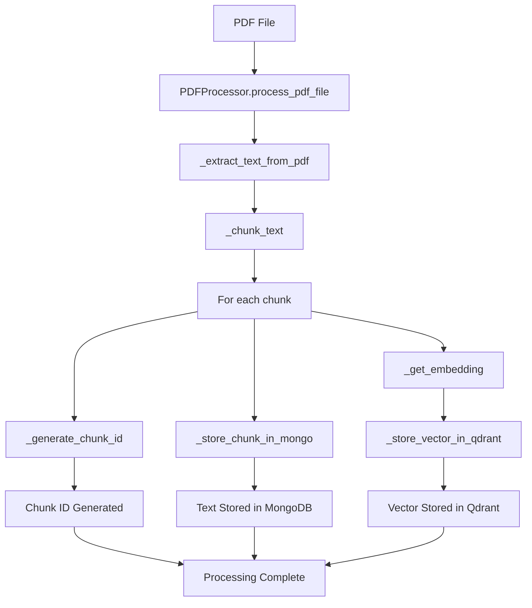
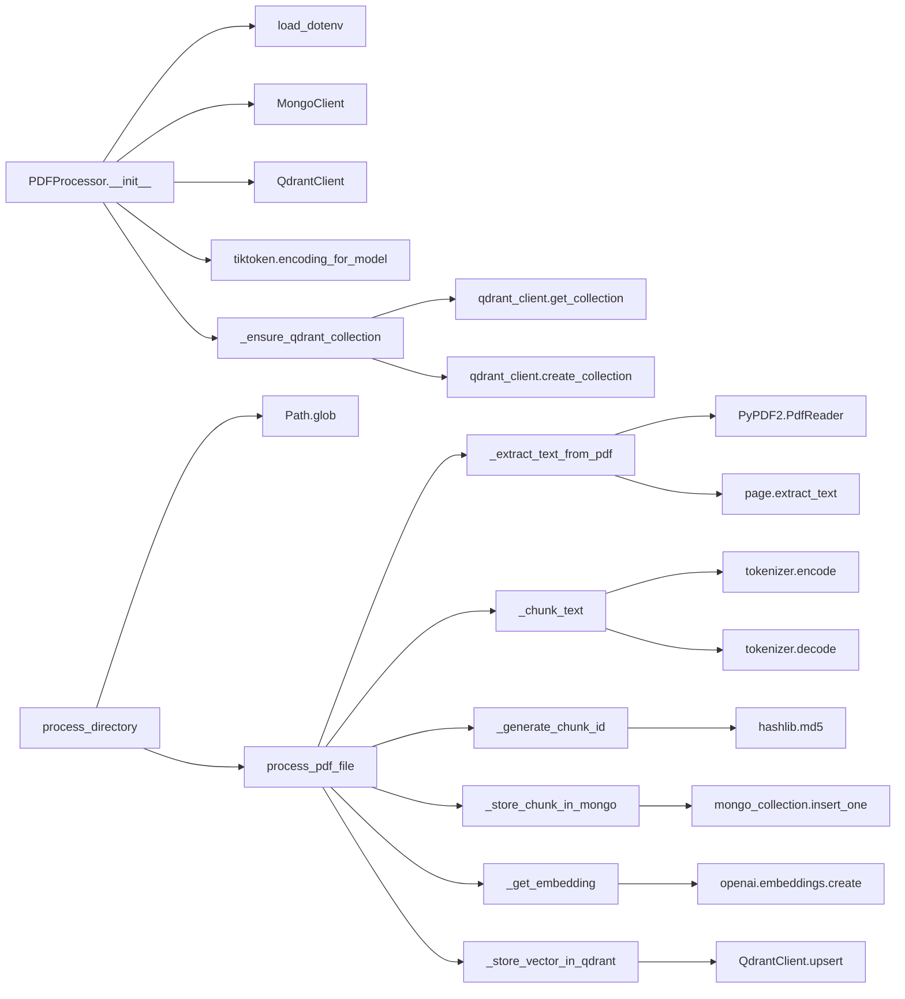

# BiblioQuiz Loader

The **Loader** module is responsible for processing PDF documents, extracting text content, chunking it into manageable segments, generating embeddings, and storing both the text chunks and their vector representations for later retrieval and search operations.

## Overview

The loader implements a complete PDF processing pipeline that transforms raw PDF documents into searchable vector embeddings. It handles the entire workflow from file ingestion to database storage, making eBooks searchable through semantic similarity.

## Key Components

### PDFProcessor Class

The `PDFProcessor` class is the core component that orchestrates the entire PDF processing workflow:

- **PDF Text Extraction**: Extracts text content from PDF files using PyPDF2
- **Intelligent Chunking**: Splits text into overlapping segments optimized for vector search
- **Embedding Generation**: Creates vector embeddings using OpenAI's Ada-002 model
- **Dual Storage**: Stores text chunks in MongoDB and vectors in Qdrant directly

## Configuration

The loader connects directly to the Qdrant vector database service and reads configuration from environment variables. For Docker deployment, use the service names (e.g., `qdrant`, `mongo`). For local development, use `localhost`.

Copy `.env.example` to `.env` and configure:

```bash
# MongoDB Configuration
MONGO_URI=mongodb://localhost:27017
MONGO_DB=biblioquiz
MONGO_COLLECTION=chunks

# Qdrant Configuration
QDRANT_HOST=qdrant  # Use 'qdrant' when running in Docker, 'localhost' for local development
QDRANT_PORT=6333
QDRANT_COLLECTION=embeddings

# OpenAI Configuration
OPENAI_API_KEY=your_openai_api_key_here
```

## Processing Pipeline



## Function Call Graph



## Key Features

### 1. Smart Text Chunking

- **Token-based chunking**: Uses tiktoken to ensure precise token counts
- **Configurable size**: Default 512 tokens per chunk (optimal for embedding models)
- **Overlap strategy**: 64-token overlap between chunks to preserve context
- **Preserves semantic boundaries**: Maintains text coherence across chunks

### 2. Embedding Generation

- **OpenAI Ada-002**: Uses state-of-the-art embedding model
- **1536-dimensional vectors**: High-quality semantic representations
- **Batch processing**: Efficient handling of multiple chunks
- **Error handling**: Robust error recovery for API failures

### 3. Dual Storage Architecture

**MongoDB (Text Storage)**:
```json
{
  "_id": "chunk_hash_id",
  "source_file": "/path/to/file.pdf",
  "chunk_index": 0,
  "text": "chunk content...",
  "token_count": 487
}
```

**Qdrant (Vector Storage)**:
```json
{
  "id": "chunk_hash_id",
  "vector": [0.1, 0.2, ...],
  "payload": {
    "source_file": "/path/to/file.pdf",
    "chunk_index": 0,
    "token_count": 487
  }
}
```

## Usage Examples

### Basic Usage

```python
from pdf_processor import PDFProcessor
from pathlib import Path

# Initialize with .env configuration
processor = PDFProcessor()

# Process a single PDF file
pdf_path = Path("book.pdf")
chunk_count = processor.process_pdf_file(pdf_path)
print(f"Processed {chunk_count} chunks")

# Process entire directory
directory = Path("books/")
results = processor.process_directory(directory)
for file_path, chunks in results.items():
    print(f"{file_path}: {chunks} chunks processed")

# Clean up connections
processor.close_connections()
```

### Custom Configuration

```python
# Use custom .env file
processor = PDFProcessor(env_file="custom.env")

# Custom chunk settings
processor = PDFProcessor(
    chunk_size=256,    # Smaller chunks
    chunk_overlap=32   # Less overlap
)
```

## Data Flow

1. **Input**: PDF files from specified directory
2. **Extraction**: Text content extracted using PyPDF2
3. **Tokenization**: Text converted to tokens using tiktoken
4. **Chunking**: Text split into overlapping segments
5. **ID Generation**: Unique hash-based IDs created for each chunk
6. **Text Storage**: Chunks stored in MongoDB with metadata
7. **Embedding**: Vector representations generated via OpenAI API
8. **Vector Storage**: Embeddings stored in Qdrant with payload metadata

## Error Handling

The loader implements comprehensive error handling:

- **File Access Errors**: Graceful handling of missing or corrupted PDFs
- **API Failures**: Retry logic for OpenAI API calls
- **Database Connectivity**: Connection recovery and failover
- **Memory Management**: Efficient processing of large documents
- **Validation**: Input validation and type checking

## Performance Considerations

### Optimization Strategies

- **Batch Processing**: Multiple chunks processed efficiently
- **Connection Pooling**: Reused database connections
- **Memory Efficiency**: Streaming text processing for large files
- **Parallel Processing**: Concurrent chunk processing capability

### Scalability

- **Horizontal Scaling**: Multiple loader instances can run simultaneously
- **Database Sharding**: Supports distributed MongoDB and Qdrant setups
- **Rate Limiting**: Built-in OpenAI API rate limit handling
- **Resource Monitoring**: Memory and CPU usage optimization

## Dependencies

### Core Dependencies
- `openai>=1.86.0` - OpenAI API client for embeddings
- `pymongo>=4.13.1` - MongoDB database driver
- `qdrant-client>=1.14.2` - Qdrant vector database client
- `PyPDF2>=3.0.1` - PDF text extraction
- `tiktoken>=0.9.0` - OpenAI tokenization
- `python-dotenv>=1.1.0` - Environment variable management

### Development Dependencies
- `pytest>=8.4.0` - Testing framework
- `pytest-cov>=6.2.1` - Coverage reporting
- `pytest-mock>=3.14.1` - Advanced mocking

## Testing

The loader includes comprehensive test coverage:

```bash
# Run tests
uv run pytest test/loader/test_pdf_processor.py -v

# Run with coverage
uv run pytest test/loader/ --cov=pdf_processor --cov-report=html
```

### Test Categories

- **Unit Tests**: Individual method functionality
- **Integration Tests**: End-to-end workflow validation
- **Mock Tests**: External API and database interaction testing
- **Performance Tests**: Large document processing validation

## Monitoring and Logging

The loader provides detailed logging for operational visibility:

- **Processing Progress**: Chunk-by-chunk processing status
- **Error Tracking**: Detailed error messages and stack traces
- **Performance Metrics**: Processing times and throughput statistics
- **Resource Usage**: Memory and API quota monitoring

## Future Enhancements

- **Multi-format Support**: Support for EPUB, DOCX, and other formats
- **Advanced Chunking**: Semantic-aware chunking strategies
- **Incremental Updates**: Delta processing for document changes
- **Metadata Extraction**: Enhanced document metadata parsing
- **Parallel Processing**: Multi-threaded chunk processing

## Weekly Scheduling

The loader service is configured to run automatically once a week (every Sunday at 2 AM) using a cron job inside the Docker container. This ensures that new PDFs added to the configured directory are processed regularly without manual intervention.

### Configuration

The loader service accepts the following environment variables:

- `PDF_PATH`: The directory path where the service looks for PDF files to process (default: `/data/book`)
- Standard database connection variables (MONGO_URL, QDRANT_URL, OPENAI_API_KEY, etc.)

### Manual Execution

For testing or one-off processing, you can run the loader manually:

```bash
# Using docker-compose
docker-compose run loader python main.py

# Or use the provided script
docker-compose exec loader ./run_loader.sh
```

## Configuration
