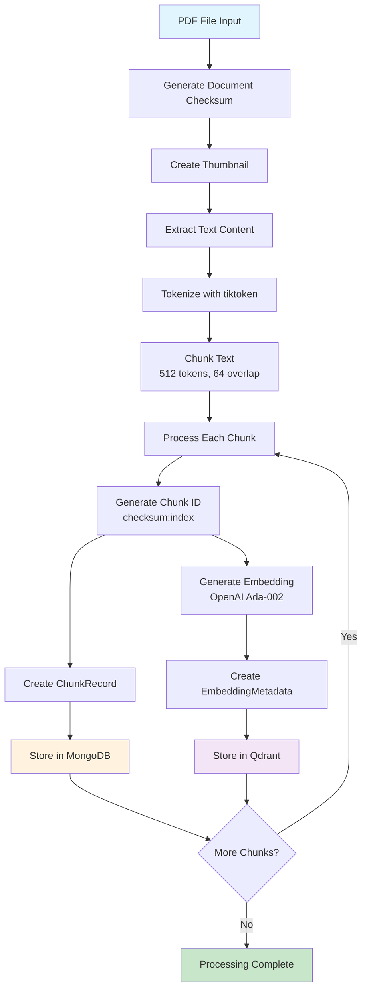
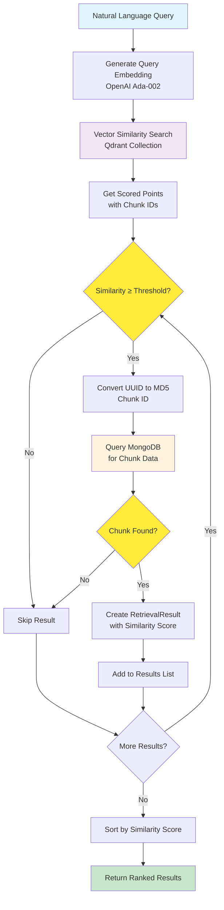
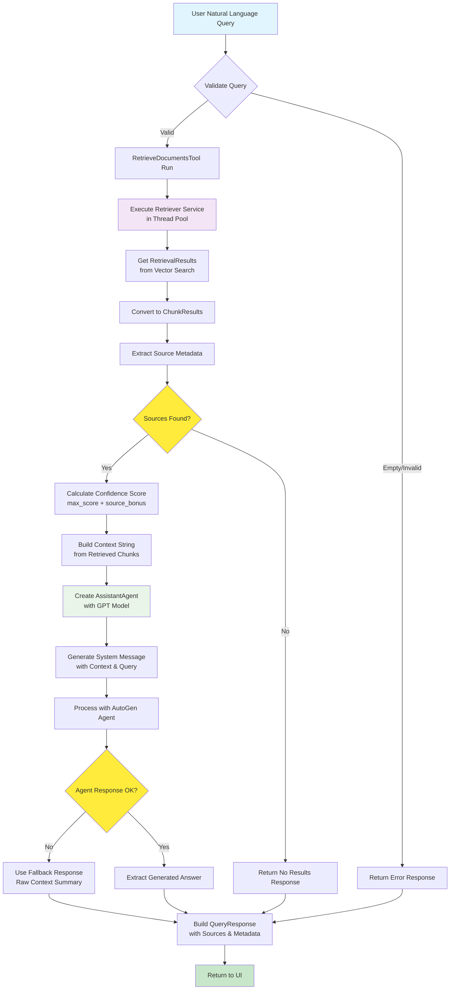

# Project Overview
The project is called **BiblioTeq**.

The application will be deployed as a **Docker Compose** application.

## Functionality
The application allows users to:
- Upload PDF files of books through a web interface.
- Query the content of the books using natural language from a web interface.
- The application uses an agentic service to interpret user requests, pull
  data from a vector database, and generate responses based on user queries.
- Process and index PDF documents with automatic text extraction and chunking.
- Perform semantic search across document collections using vector embeddings.

## Modules
- `ui`: The frontend.
  - `web`: A web application built with Streamlit, including components,
      services, and custom styling.
- `semql`: Semantic Query Layer - an agentic service that interprets user
    requests, pulls data from a vector database and generates responses based
    on user queries using OpenAI's GPT models.
- `loader`: Chunks and encodes data from PDF files and stores it in a vector
    database and document database.
- `retriever`: A service that retrieves data from the vector database and
    document database based on user queries.
- `config`: Configuration management for the application.
- `schema`: Data models and schemas for the application.
- `inspector`: A database inspection service for browsing and analyzing stored
    documents, chunks, and embeddings in MongoDB and Qdrant. _(To be implemented)_

## Libraries
These are the libraries currently used in the project:
- `streamlit`: For the web user interface.
- `autogen-agentchat` and `autogen-ext[openai]`: For the agentic workflow that
    integrates the front end and data storage services.
- `openai`: For GPT-4 integration and AI-powered query processing.
- `python-dotenv`: To manage environment variables.
- `qdrant-client`: Used for interacting with the Qdrant vector database.
- `pymongo`: Used for interacting with MongoDB document database.
- `tiktoken`: Used for tokenization and chunking data from PDF files.
- `pypdf`: Used for reading and extracting text from PDF files.
- `pdf2image`: For converting PDF pages to images.
- `pillow`: For image processing and manipulation.

## Tools
- `make` for build automation and task management.
- `pytest`: For testing.
- `ruff` for linting and code formatting.
- `uv` for dependency management and virtual environments.
- `vulture`: For finding unused code.
- `git-cliff`: For generating changelogs.

## Loader

The Loader module is responsible for the complete PDF processing pipeline that transforms documents into searchable, indexed content. It handles PDF ingestion, text extraction, chunking, embedding generation, and storage in both document and vector databases.

### Key Responsibilities:
- **PDF Processing**: Reads PDF files and extracts text content
- **Content Deduplication**: Uses MD5 checksums for content-based duplicate detection
- **Thumbnail Generation**: Creates visual previews from the first page of each PDF
- **Text Chunking**: Splits documents into 512-token chunks with 64-token overlap for optimal retrieval
- **Embedding Generation**: Creates vector embeddings using OpenAI's Ada-002 model
- **Dual Storage**: Stores document chunks in MongoDB and vector embeddings in Qdrant
- **Consistent ID Generation**: Creates deterministic chunk IDs based on content checksums

### Process Flow:

### Architecture Benefits:
- **Idempotent Processing**: Same content always generates identical chunk IDs
- **Scalable Chunking**: Token-based chunking ensures consistent semantic boundaries
- **Dual Database Strategy**: MongoDB for structured data, Qdrant for vector similarity search
- **Visual Identification**: Thumbnails provide quick document recognition in the UI

## Retriever

The Retriever module handles the search and retrieval of relevant document chunks based on natural language queries. It bridges the gap between user questions and stored content by performing semantic similarity search across vector embeddings and retrieving associated text chunks from the document database.

### Key Responsibilities:
- **Query Embedding**: Converts natural language queries into vector embeddings using OpenAI's Ada-002 model
- **Vector Search**: Performs cosine similarity search in Qdrant to find semantically similar content
- **Content Retrieval**: Fetches corresponding text chunks and metadata from MongoDB
- **Relevance Filtering**: Applies configurable similarity thresholds to ensure result quality
- **Result Ranking**: Returns results sorted by similarity score with comprehensive metadata

### Process Flow:

### Architecture Benefits:
- **Semantic Understanding**: Vector embeddings capture meaning beyond keyword matching
- **Configurable Precision**: Adjustable similarity thresholds and result limits
- **Dual Database Coordination**: Leverages both vector and document databases efficiently
- **Consistent Identification**: Works with content-based chunk IDs for reliable retrieval
- **Rich Metadata**: Returns comprehensive document context including thumbnails and provenance

## Semantic Query Layer (semql)

The Semantic Query Layer (semql) serves as the intelligent orchestrator that bridges natural language queries with the document knowledge base. It implements an agentic workflow using AutoGen to interpret user requests, retrieve relevant content, and generate contextual responses using large language models.

### Key Responsibilities:
- **Query Interpretation**: Processes natural language questions about document content
- **Agentic Workflow**: Uses AutoGen agents to coordinate complex query processing
- **Context Retrieval**: Leverages the retriever service to find relevant document chunks
- **Response Generation**: Synthesizes information using OpenAI's GPT models to create comprehensive answers
- **Source Attribution**: Provides detailed provenance and confidence scoring for transparency
- **Error Handling**: Gracefully manages failures and provides meaningful feedback

### Process Flow:

### Architecture Benefits:
- **Intelligent Synthesis**: Goes beyond simple retrieval to generate contextual, comprehensive answers
- **Transparent Provenance**: Always provides sources and confidence scores for user trust
- **Flexible Agent Framework**: AutoGen allows for sophisticated multi-agent workflows
- **Robust Error Handling**: Graceful degradation ensures users always get meaningful responses
- **Async Processing**: Non-blocking operations for responsive user experience
- **Context Management**: Intelligent chunking and context window management for optimal LLM performance
